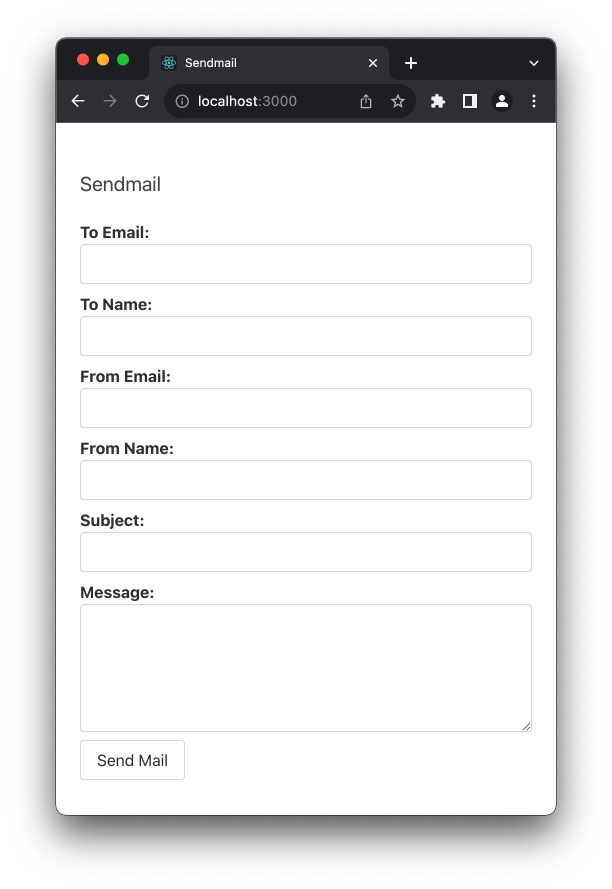

# Sendmail

### Starting the app

1. Clone the repo: [git@github.com:adampbragg/sendmail.git](git@github.com:adampbragg/sendmail.git)
2. Navigate into the `server` directory.
3. Drop the `.env.local` file obtained from me into this directory.
4. Run `npm run serve`.
5. Navigate to the `client` directory.
6. Run `npm run start`.
7. Navigate in your browser to [http://localhost:3000](http://localhost:3000)

### Using the App

1. Fill out the form.
2. Hit submit.
3. See the success message.

*(You can add `html` to the Message field).*

### Testing the Service

• From within the `server` directory, run `npm run test`.

### Checking Code Coverage

• From within the `server` directory, run `npm run coverage`.

## Service API

The service is a simple API accepting json describing the message.

**endpoint:** http://localhost:3000/  

### --To Send Mail--
**method:** POST  
**path:** /  
**parameters:** (none)  
**payload/body:**  
`{`  
  `to: email` *(required)*  
  `to_name: string` *(required)*  
  `from: email` *(required)*  
  `from_name: string` *(required)*  
  `subject: string` *(required)*  
  `message: string` *(required)*  
`}`

### Example `curl` Request:
`curl -d '{`  
  `"to": "adam@adambragg.com",`  
  `"to_name": "Adam P. Bragg",`  
  `"from": "adampbragg@gmail.com",`  
  `"from_name": "Adam",`  
  `"subject": "Livin in the new world",`  
  `"message": "with an old soul."`  
`}' \`  
`-X POST 'http://localhost:3000' \`  
`-H "Content-Type: application/json"`

### Discussion

1. **Lanugage, Framework, and Libraries:**  
I used Javascript since it is the language with which I am most faviliar.  
I used nodejs for the backend server since it is instrumented using Javascript and is a low latency server.  
I used koa for the backend framework. It is lightweight and uses principles similar to its ancestor, expressjs. I also wanted to work with something I had not yet.  
For testing, I used ava. Ava is straightforward without any boilerplate.  
I used a few other libraries for some tasks like working with HTML, c8 for coverage reporting, and some middleware for koa.
For the client, I used React for the framework, axios to simplify communication with the backend, and Bulma as the styles framework. I created the client to demonstrate a bit of my frontent skills and to make operating the backend a little simpler.

2. **Tradeoffs or things I would do differently:**  
I would rather the configurations for each mail service were stored in a remote data structure that could be updated separately from a full release. The environment files are convenient but are simply stirngs and would be better suited for a document store.  
I also would like to add a bit of documentation to each of the files. Some of it is easy to understand, but documentation would likely speed up an engineer's understanding who is unfamiliar with the code.  
The errors that come from the remote services could use a little dressing before they are handed off to the client to make them more meaningful to the end user.

3. **Time spent:**  
My work on this was quite fractured. I expect I spent somewhere around 12 hours on the full project.
